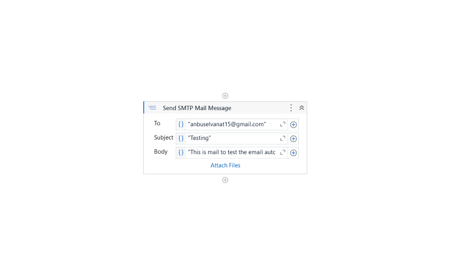

## AIM: 
  To create a workflow in UiPath that reads data from an Excel file and writes the same data into another Excel file.

## REG NO: 212221040020
 
## Activites Required:
  1. Send SMTP Mail Message

## Procedure:
  #### 1. Create a New Project in UiPath Studio:
  - Open UiPath Studio.
  - Select Process and create a new project named SendGmailEmail.

#### 2. Install the Required Packages:
  - Go to the Manage Packages option in the Activities panel.
  - Search for and install the UiPath.Mail.Activities package.

#### 3. Add the 'Send SMTP Mail Message' Activity:
  - In the Activities panel, search for Send SMTP Mail Message.
  - Drag this activity into the Designer panel.

#### 4. Configure Gmail SMTP Settings:
  In the Send SMTP Mail Message activity, configure the following properties:
  - To: Enter the recipient’s email address (e.g., "recipient@example.com").
  - Subject: Enter the subject of your email (e.g., "Test Email from UiPath").
  - Body: Enter the body content of the email (e.g., "Hello, this is a test email sent using UiPath.").
  - SMTP Server: Set it to "smtp.gmail.com".
  - Port: Set it to 587.
  - Enable SSL: Check this option to enable SSL.
  - Username: Enter your Gmail address (e.g., "your-email@gmail.com").
  - Password: Enter your Gmail password or use a secure password stored in UiPath Orchestrator assets.

#### 5. Handle Gmail Security Settings:
  - Ensure that you have enabled "Less secure app access" in your Gmail account settings or generated an App-Specific Password if you have 2-Step Verification enabled.

#### 6. Test the Workflow:
  - Save and run the workflow.
  - Check the recipient's inbox to confirm the email was sent successfully.

## Workflow:

## Output:

## Result:
  Thus, the automation for sending an email is implemented successfully.
